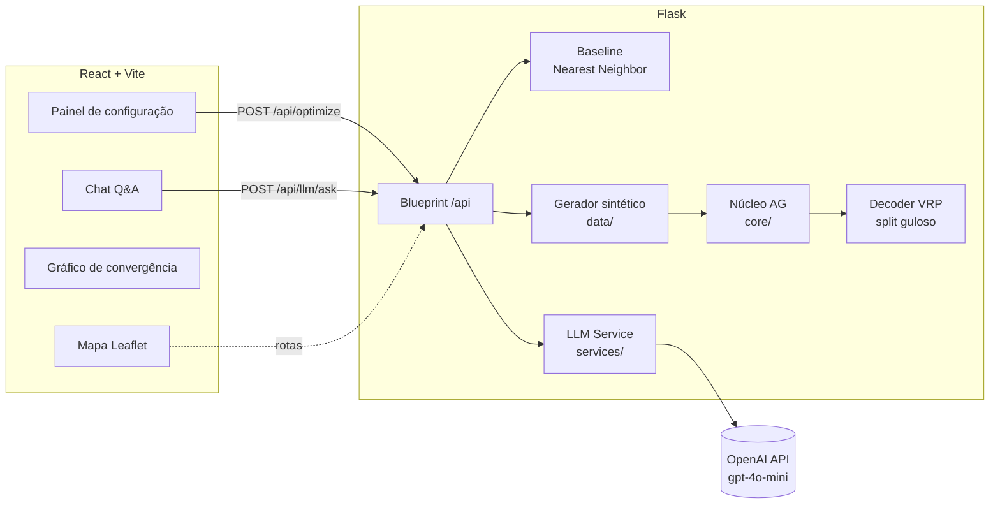
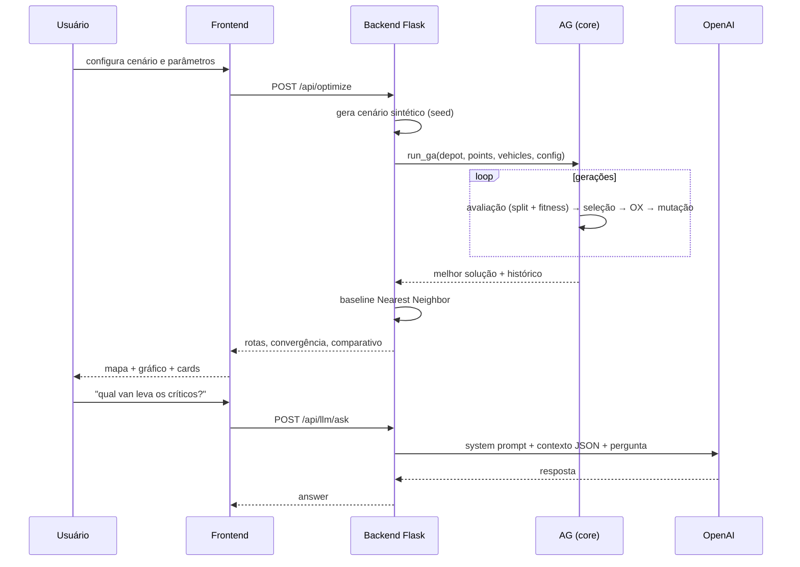
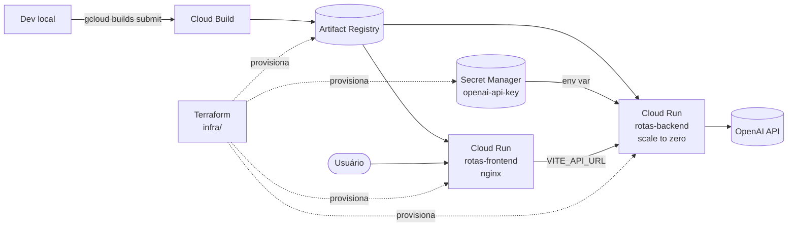

# Arquitetura

## Visão geral (local)



## Fluxo da otimização



## Nuvem (GCP)



Escolhi o Cloud Run por ser um serviço serverless com escalabilidade automática.
Limitei o serviço a duas instâncias para controlar o uso durante a demonstração.

As imagens Docker ficam no Artifact Registry. A chave da OpenAI fica no Secret
Manager e é injetada no backend como variável de ambiente, sem ser gravada no
código ou no estado do Terraform. Declarei os recursos em `infra/` com Terraform.
Usei a região `us-central1` na configuração de exemplo.

## Deploy passo a passo

```bash
# 0. pré-requisitos: gcloud CLI + terraform instalados, projeto criado
gcloud auth login
gcloud auth application-default login
gcloud config set project SEU_PROJETO

# 1. provisionar a infra (na primeira vez o apply cria o Artifact Registry;
#    os serviços Cloud Run só sobem depois do push das imagens)
cd infra
cp terraform.tfvars.example terraform.tfvars   # editar project_id e imagens
terraform init
terraform apply -target=google_artifact_registry_repository.repo \
                -target=google_secret_manager_secret.openai_key

# 2. subir a chave da OpenAI (fora do state do Terraform, de propósito)
echo -n "sk-..." | gcloud secrets versions add openai-api-key --data-file=-

# 3. build + push das imagens via Cloud Build
gcloud builds submit ../backend \
  -t us-central1-docker.pkg.dev/SEU_PROJETO/rotas-medicas/backend:latest

# o frontend precisa saber a URL do backend em build time (Vite),
# por isso uso um cloudbuild.yaml com build-arg:
gcloud builds submit ../frontend --config ../frontend/cloudbuild.yaml \
  --substitutions=_VITE_API_URL=https://rotas-backend-XXXX.run.app,_IMAGE=us-central1-docker.pkg.dev/SEU_PROJETO/rotas-medicas/frontend:latest

# 4. subir o resto da infra
terraform apply

# 5. URLs de saída
terraform output frontend_url
terraform output backend_url
```

URL atual do frontend em produção: https://rotas-frontend-obejqx6ika-uc.a.run.app
