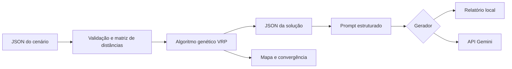
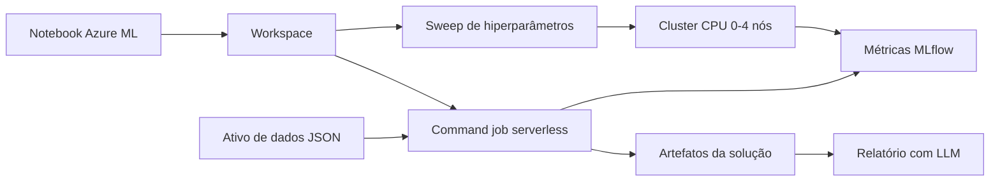

# Otimização de rotas para distribuição de medicamentos e insumos

## 1. Contexto e objetivo

A distribuição entre unidades hospitalares e pontos de atendimento domiciliar exige
que demandas com urgências distintas sejam atendidas com uma frota limitada. O
objetivo da solução é reduzir o percurso total sem perder de vista a prioridade
clínica, a capacidade de carga e a autonomia de cada veículo. O cenário utilizado é
fictício e contém um depósito, dez pontos de entrega e três veículos.

## 2. Modelagem do problema

O problema clássico do caixeiro viajante procura a menor rota que visita cada ponto
uma única vez e retorna à origem. Aqui, a formulação é ampliada para um problema de
roteamento de veículos: cada entrega pertence a exatamente uma rota e toda rota
começa e termina no depósito.

Cada entrega possui coordenadas, demanda em quilogramas, tempo de serviço e
prioridade de 1 (regular) a 3 (crítica). Cada veículo possui capacidade e autonomia.
As distâncias são calculadas pela fórmula de Haversine e armazenadas em uma matriz
de adjacência. O cálculo representa distância geodésica; portanto, não inclui trânsito,
sentido das vias ou tempo real de deslocamento.

## 3. Algoritmo genético

### 3.1 Representação e população inicial

Um indivíduo é uma permutação dos índices das entregas. Essa codificação
combinatória impede repetição ou omissão de pontos. Um decodificador percorre o
cromossomo e atribui cada entrega ao veículo de menor custo projetado, considerando
as proporções de carga e autonomia e dando preferência a alocações sem violação.

A população combina indivíduos aleatórios com dois *hotstarts*: prioridades em
ordem decrescente e vizinho mais próximo ajustado pela prioridade. A semente
pseudoaleatória é configurável, o que permite repetir os experimentos.

### 3.2 Aptidão

Como o problema é de minimização, valores menores são melhores:

\[
f(x)=D+\alpha P+\beta E_c+\gamma E_a
\]

em que `D` é a distância total; `P` é a soma da distância acumulada até cada parada,
ponderada por sua prioridade; `Ec` e `Ea` são os excessos de capacidade e autonomia.
Os coeficientes padrão são `α=0,35`, `β=1.000` e `γ=1.000`. Penalidades altas fazem
com que uma solução viável seja preferida a uma pequena redução de percurso obtida
com violação operacional.

### 3.3 Operadores e término

A seleção é feita por torneio. O Ordered Crossover (OX1) copia um segmento do
primeiro pai e completa as posições com a ordem relativa do segundo, mantendo uma
permutação válida. A mutação alterna entre troca de dois genes e inversão de um
segmento. O elitismo preserva os melhores indivíduos. A execução termina ao atingir
o número máximo de gerações ou o limite de gerações sem melhora.

O histórico registra melhor aptidão, média e desvio-padrão por geração. Esses dados
permitem observar convergência e diversidade da população.

## 4. Tratamento das restrições

- **Prioridade:** entregas críticas recebem penalidade maior conforme aumenta a
  distância percorrida antes do atendimento.
- **Carga:** a demanda total de uma rota é confrontada com a capacidade específica
  do veículo; excessos são penalizados e apresentados no resultado.
- **Autonomia:** o percurso completo, incluindo o retorno, é comparado com a
  distância máxima do veículo.
- **Múltiplos veículos:** o decodificador cria uma rota por veículo, e cada entrega é
  alocada uma única vez.

Uma limitação consciente é o uso de restrições flexíveis por penalização. Isso permite
diagnosticar cenários sem solução, mas não prova viabilidade antes da busca. Demandas
maiores que a capacidade de qualquer veículo, janelas de tempo e carga fracionada não
são tratadas nesta versão.

## 5. Comparação de abordagens

Foram incluídas três abordagens com papéis distintos:

| Abordagem | Vantagem | Limitação | Uso |
|---|---|---|---|
| Força bruta | Encontra o ótimo no espaço avaliado | Crescimento fatorial `O(n!)` | Cenários com até nove entregas |
| Vizinho mais próximo | Muito rápido e simples | Decisão local pode produzir rota ruim | Linha de base e *hotstart* |
| Algoritmo genético | Explora espaço amplo e aceita restrições | Não garante o ótimo global | Cenário completo |

O programa informa a variação de fitness do algoritmo genético frente ao vizinho mais
próximo. Comparações devem usar a mesma função de aptidão e a mesma instância. Tempo
e economia monetária não são inventados: só podem ser calculados quando houver dados
históricos ou medições reais.

## 6. Visualização e análise

O mapa HTML apresenta o depósito, a sequência numerada das paradas e uma cor para
cada veículo. O gráfico de convergência compara o melhor fitness e a média da
população. Juntos, os artefatos permitem conferir a distribuição, identificar rotas
longas e avaliar se a busca estabilizou precocemente.

## 7. Integração com modelo de linguagem

A camada de relatórios recebe somente a solução estruturada. O prompt define papel,
tarefa, idioma e regras contra alucinação; em seguida inclui o contexto em JSON. A
temperatura baixa (`0,2`) favorece respostas estáveis. A API do Gemini representa a
estratégia de uso de um modelo pré-treinado, evitando o custo de treinamento local.

Há duas implementações da mesma interface. A integração Gemini é utilizada por padrão
e a implementação local preserva a possibilidade de testes determinísticos:

1. `GeminiReportGenerator`, que gera instruções, relatórios e respostas com a API;
2. `LocalReportGenerator`, que cria um documento determinístico sem simular uma LLM.

O modo local mantém testes e demonstrações reproduzíveis. Respostas da LLM devem ser
revisadas por uma pessoa antes do uso operacional, pois modelos generativos podem
alucinar. Dados pessoais e clínicos não devem ser enviados; o exemplo usa somente
identificadores operacionais fictícios.

## 8. Arquitetura e infraestrutura

O domínio não depende da visualização nem da LLM. Essa separação facilita testes e
permite trocar o provedor sem alterar o otimizador. Docker empacota a aplicação e o
Terraform provisiona a imagem e o contêiner, com a credencial fornecida como variável
sensível.

### 8.1 Execução no Azure Machine Learning

A extensão em nuvem utiliza o Azure Machine Learning Workspace como ambiente de
experimentação. O cenário JSON é registrado como ativo de dados versionado. Um
command job executa o mesmo núcleo Python em computação serverless, registra
parâmetros e métricas com MLflow e persiste solução, mapa, convergência, relatório e
histórico no output do job.

O ajuste de hiperparâmetros utiliza busca aleatória sobre tamanho da população, taxas
de crossover e mutação e elitismo. A função objetivo é minimizar `fitness`. Até quatro
tentativas podem ser processadas simultaneamente em um cluster CPU de baixa
prioridade, configurado para escalar a zero nós quando ocioso. AutoML não é utilizado,
pois não há treinamento supervisionado: trata-se de otimização combinatória com uma
função de aptidão própria.

O Terraform cria Resource Group, armazenamento, Key Vault, Log Analytics,
Application Insights, Workspace e cluster. Credenciais não são incluídas no código.
Como recursos em nuvem podem gerar cobrança, a Compute Instance deve ser desligada
e a infraestrutura removida quando os experimentos terminarem.

## 9. Testes e reprodutibilidade

Os testes verificam distância, validações, preservação da permutação pelo OX1, visita
única, penalização de rota inviável, reprodutibilidade, convergência e fundamentação do
prompt. A execução completa é feita com `pytest`. O notebook reproduz o experimento,
compara a linha de base e gera as visualizações.

## 10. Conclusão

A combinação de representação combinatória e decodificação multi-veículo preserva os
operadores próprios do TSP e incorpora restrições logísticas. A aptidão torna explícito
o compromisso entre percurso, urgência e viabilidade. A integração generativa ocorre
após a otimização e recebe dados estruturados, reduzindo o risco de instruções sem
base. Para uso real, os próximos dados necessários são a matriz viária, tempos
históricos, janelas de atendimento e custos operacionais.
