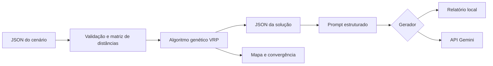
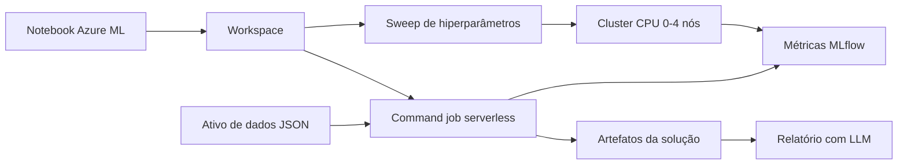

# Otimização de rotas para distribuição de medicamentos e insumos

## 1. Contexto e objetivo

A distribuição entre unidades hospitalares e pontos de atendimento domiciliar exige
que demandas com urgências distintas sejam atendidas com uma frota limitada. O
objetivo da solução é reduzir o percurso total sem perder de vista a prioridade
clínica, a capacidade de carga e a autonomia de cada veículo. O cenário utilizado é
fictício e contém um depósito, dez pontos de entrega e três veículos.

### 1.1 Método de desenvolvimento e avaliação

O desenvolvimento partiu da formulação didática do TSP apresentada nas aulas:
representação por permutação, matriz de distâncias, função de aptidão, seleção,
crossover ordenado, mutação e acompanhamento da convergência. A evolução para o
contexto hospitalar ocorreu em incrementos verificáveis: primeiro foram incluídas
prioridades; depois, capacidade e autonomia; por fim, a permutação passou a ser
decodificada em uma rota para cada veículo. Essa estratégia mantém os operadores
adequados ao TSP e concentra as regras adicionais na avaliação e na decodificação.

A avaliação combina testes automatizados, algoritmos de referência, repetições com
sementes distintas e inspeção visual das rotas e da convergência. Os resultados
numéricos se referem ao cenário fictício versionado em `data/deliveries.json`.

## 2. Modelagem do problema

O problema clássico do caixeiro viajante procura a menor rota que visita cada ponto
uma única vez e retorna à origem. Aqui, a formulação é ampliada para um problema de
roteamento de veículos: cada entrega pertence a exatamente uma rota e toda rota
começa e termina no depósito.

Cada entrega possui coordenadas, demanda em quilogramas, tempo de serviço e
prioridade de 1 (regular) a 3 (crítica). Cada veículo possui capacidade e autonomia.
As distâncias são calculadas pela fórmula de Haversine e armazenadas em uma matriz
de adjacência. O cálculo representa distância geodésica; portanto, não inclui trânsito,
sentido das vias ou tempo real de deslocamento.

## 3. Algoritmo genético

### 3.1 Representação e população inicial

Um indivíduo é uma permutação dos índices das entregas. Essa codificação
combinatória impede repetição ou omissão de pontos. Um decodificador percorre o
cromossomo e atribui cada entrega ao veículo de menor custo projetado, considerando
as proporções de carga e autonomia e dando preferência a alocações sem violação.

A população combina indivíduos aleatórios com dois *hotstarts*: prioridades em
ordem decrescente e vizinho mais próximo ajustado pela prioridade. A semente
pseudoaleatória é configurável, o que permite repetir os experimentos.

### 3.2 Aptidão

Como o problema é de minimização, valores menores são melhores:

\[
f(x)=D+\alpha P+\beta E_c+\gamma E_a
\]

em que `D` é a distância total; `P` é a soma da distância acumulada até cada parada,
ponderada por sua prioridade; `Ec` e `Ea` são os excessos de capacidade e autonomia.
Os coeficientes padrão são `α=0,35`, `β=1.000` e `γ=1.000`. Penalidades altas fazem
com que uma solução viável seja preferida a uma pequena redução de percurso obtida
com violação operacional.

### 3.3 Operadores e término

A seleção é feita por torneio. O Ordered Crossover (OX1) copia um segmento do
primeiro pai e completa as posições com a ordem relativa do segundo, mantendo uma
permutação válida. A mutação alterna entre troca de dois genes e inversão de um
segmento. O elitismo preserva os melhores indivíduos. A execução termina ao atingir
o número máximo de gerações ou o limite de gerações sem melhora.

O histórico registra melhor aptidão, média e desvio-padrão por geração. Esses dados
permitem observar convergência e diversidade da população.

## 4. Tratamento das restrições

- **Prioridade:** entregas críticas recebem penalidade maior conforme aumenta a
  distância percorrida antes do atendimento.
- **Carga:** a demanda total de uma rota é confrontada com a capacidade específica
  do veículo; excessos são penalizados e apresentados no resultado.
- **Autonomia:** o percurso completo, incluindo o retorno, é comparado com a
  distância máxima do veículo.
- **Múltiplos veículos:** o decodificador cria uma rota por veículo, e cada entrega é
  alocada uma única vez.

Uma limitação consciente é o uso de restrições flexíveis por penalização. Isso permite
diagnosticar cenários sem solução, mas não prova viabilidade antes da busca. Demandas
maiores que a capacidade de qualquer veículo, janelas de tempo e carga fracionada não
são tratadas nesta versão.

## 5. Comparação de abordagens

Foram incluídas três abordagens com papéis distintos:

| Abordagem | Vantagem | Limitação | Uso |
|---|---|---|---|
| Força bruta | Encontra o ótimo no espaço avaliado | Crescimento fatorial `O(n!)` | Cenários com até nove entregas |
| Vizinho mais próximo | Muito rápido e simples | Decisão local pode produzir rota ruim | Linha de base e *hotstart* |
| Algoritmo genético | Explora espaço amplo e aceita restrições | Não garante o ótimo global | Cenário completo |

O programa informa a variação de fitness do algoritmo genético frente ao vizinho mais
próximo. Comparações devem usar a mesma função de aptidão e a mesma instância. Tempo
e economia monetária não são inventados: só podem ser calculados quando houver dados
históricos ou medições reais.

### 5.1 Protocolo experimental e resultados

No cenário completo, o algoritmo foi executado cinco vezes com população 80, limite
de 150 gerações, estagnação de 50 gerações e sementes 7, 21, 42, 84 e 123. A mesma
função de aptidão foi usada em todas as abordagens. O vizinho mais próximo obteve
fitness `150,17`. Os resultados do algoritmo genético foram:

| Semente | Fitness | Distância (km) | Gerações | Redução de fitness frente à referência |
|---:|---:|---:|---:|---:|
| 7 | 123,97 | 67,58 | 75 | 17,55% |
| 21 | 123,97 | 67,58 | 78 | 17,55% |
| 42 | 126,92 | 65,34 | 79 | 15,58% |
| 84 | 127,44 | 68,54 | 65 | 15,24% |
| 123 | 123,97 | 67,58 | 101 | 17,55% |

A média foi `125,25`, com desvio-padrão populacional `1,58`; a redução média de
fitness foi `16,70%`. A menor distância não coincide necessariamente com o menor
fitness, pois a função também valoriza o atendimento antecipado das entregas
prioritárias. A variação entre sementes é esperada em uma meta-heurística e justifica
reportar mais de uma execução.

Em uma subinstância com oito entregas, a força bruta encontrou fitness `91,22` e
distância `54,72 km`; o algoritmo genético alcançou o mesmo resultado. O vizinho mais
próximo obteve fitness `123,99` e distância `72,62 km`. Tempos de execução não são
generalizados, pois dependem do equipamento e da configuração. O notebook calcula
novamente as medidas, permitindo confrontar o texto com a execução corrente.

## 6. Visualização e análise

O mapa HTML apresenta o depósito, a sequência numerada das paradas e uma cor para
cada veículo. O gráfico de convergência compara o melhor fitness e a média da
população. Juntos, os artefatos permitem conferir a distribuição, identificar rotas
longas e avaliar se a busca estabilizou precocemente.

## 7. Integração com modelo de linguagem

A camada de relatórios recebe somente a solução estruturada. O prompt define papel,
tarefa, idioma e regras contra alucinação; em seguida inclui o contexto em JSON. A
temperatura baixa (`0,2`) favorece respostas estáveis. A API do Gemini representa a
estratégia de uso de um modelo pré-treinado, evitando o custo de treinamento local.

Há duas implementações da mesma interface. A integração Gemini é utilizada por padrão
e a implementação local preserva a possibilidade de testes determinísticos:

1. `GeminiReportGenerator`, que gera instruções, relatórios e respostas com a API;
2. `LocalReportGenerator`, que cria um documento determinístico sem simular uma LLM.

O modo local mantém testes e demonstrações reproduzíveis. Respostas da LLM devem ser
revisadas por uma pessoa antes do uso operacional, pois modelos generativos podem
alucinar. Dados pessoais e clínicos não devem ser enviados; o exemplo usa somente
identificadores operacionais fictícios.

As tarefas disponibilizadas abrangem instruções por veículo, resumo diário, relatório
semanal com sugestões e respostas a perguntas em linguagem natural. O contexto inclui
somente valores calculados pelo otimizador e pelo comparativo. A saída não altera rotas
nem decisões de viabilidade: sua função é explicar os resultados.

O RAG estudado nas aulas não foi aplicado porque não há, neste escopo, uma coleção
documental externa a ser recuperada. O aterramento ocorre diretamente pelo JSON da
solução. Incluir busca vetorial sem uma base de protocolos ou manuais acrescentaria
complexidade sem evidência adicional. Caso documentos institucionais sejam incluídos,
eles deverão ser versionados e recuperados com referência de origem.

## 8. Arquitetura e infraestrutura

O domínio não depende da visualização nem da LLM. Essa separação facilita testes e
permite trocar o provedor sem alterar o otimizador. Docker empacota a aplicação e o
Terraform provisiona a imagem e o contêiner, com a credencial fornecida como variável
sensível.

### 8.1 Execução no Azure Machine Learning

A extensão em nuvem utiliza o Azure Machine Learning Workspace como ambiente de
experimentação. O cenário JSON é registrado como ativo de dados versionado. Um
command job executa o mesmo núcleo Python em computação serverless, registra
parâmetros e métricas com MLflow e persiste solução, mapa, convergência, relatório e
histórico no output do job.

O ajuste de hiperparâmetros utiliza busca aleatória sobre tamanho da população, taxas
de crossover e mutação e elitismo. A função objetivo é minimizar `fitness`. Até quatro
tentativas podem ser processadas simultaneamente em um cluster CPU de baixa
prioridade, configurado para escalar a zero nós quando ocioso. AutoML não é utilizado,
pois não há treinamento supervisionado: trata-se de otimização combinatória com uma
função de aptidão própria.

O Terraform cria Resource Group, armazenamento, Key Vault, Log Analytics,
Application Insights, Workspace e cluster. Credenciais não são incluídas no código.
Como recursos em nuvem podem gerar cobrança, a Compute Instance deve ser desligada
e a infraestrutura removida quando os experimentos terminarem.

## 9. Testes e reprodutibilidade

Os testes verificam distância, validações, preservação da permutação pelo OX1, visita
única, penalização de rota inviável, reprodutibilidade, convergência e fundamentação do
prompt. A execução completa é feita com `pytest`. O notebook reproduz o experimento,
compara a linha de base e gera as visualizações.

O ambiente é descrito em `pyproject.toml`, `requirements.txt`, `Dockerfile` e nos
arquivos do Azure ML. A semente controla a aleatoriedade, mas a repetição exata também
depende das versões das bibliotecas. O notebook principal registra parâmetros,
métricas e artefatos, enquanto o job em nuvem registra métricas no MLflow.

## 10. Rastreabilidade dos requisitos e entregáveis

| Critério | Evidência principal | Situação |
|---|---|---|
| Representação genética de rotas | `src/hospital_routes/genetic.py` | Atendido |
| Seleção, crossover e mutação especializados | torneio, OX1, troca e inversão | Atendido |
| Fitness com distância e prioridade | avaliação e matriz Haversine | Atendido |
| Capacidade, autonomia e múltiplos veículos | decodificador e penalidades | Atendido |
| Cenários customizáveis e elitismo opcional | interface Pygame e notebooks | Atendido |
| Mapa e convergência | `visualization.py` e interface em tempo real | Atendido |
| Instruções, relatórios e melhorias com LLM | `reporting.py` | Atendido |
| Perguntas em linguagem natural | tarefa `question` demonstrada no notebook | Atendido |
| Prompt estruturado e prevenção de alucinação | `build_prompt` e contexto JSON | Atendido |
| Projeto Python e ambiente virtual | pacote em `src`, `pyproject.toml` e README | Atendido |
| Diagramas de arquitetura | `docs/arquitetura.md` e seção 8 | Atendido |
| Testes automatizados | diretório `tests` | Atendido |
| Infraestrutura como código | Terraform local e Azure | Atendido |
| Scripts e notebooks de demonstração | três notebooks e CLI | Atendido |
| Comparativo de desempenho | seção 5 e notebook principal | Atendido |
| Configuração opcional em nuvem | `azure`, `infra/azure` e notebook Azure ML | Atendido |
| Documentação de API REST | não aplicável: não há serviço HTTP | Justificado |

A ausência de uma API REST é uma decisão de arquitetura: as superfícies são a
interface interativa, os notebooks, a CLI e o job Azure ML. Portanto, não há endpoints
a documentar. As funções públicas e os argumentos da CLI são documentados no código e
em `docs/uso.md`.

## 11. Limitações, validade e uso responsável

- A distância geodésica não representa malha viária, trânsito, bloqueios ou tempo de
  atendimento; por isso, não se afirma economia temporal ou monetária.
- As restrições são flexíveis. Uma solução inviável é um diagnóstico do cenário, não
  uma autorização para executar entregas acima dos limites.
- A força bruta é usada apenas em instâncias reduzidas devido ao crescimento fatorial.
- O algoritmo genético não garante ótimo global; múltiplas sementes e uma referência
  conhecida reduzem, mas não eliminam, essa ameaça à validade.
- Os dados são fictícios e não incluem pacientes. Uma aplicação institucional exigiria
  minimização de dados, controle de acesso, retenção definida e revisão humana.
- Instruções da LLM podem conter omissões. O JSON da solução é a fonte de verdade, e o
  relatório precisa de validação operacional antes do uso.

Embora o processamento seja executado no Azure Machine Learning, não há treinamento
de um modelo preditivo. O algoritmo genético é um método de otimização, e MLflow é
utilizado para rastrear experimentos e hiperparâmetros. Essa distinção evita classificar
incorretamente a busca combinatória como aprendizado supervisionado.

## 12. Conclusão

A combinação de representação combinatória e decodificação multi-veículo preserva os
operadores próprios do TSP e incorpora restrições logísticas. A aptidão torna explícito
o compromisso entre percurso, urgência e viabilidade. A integração generativa ocorre
após a otimização e recebe dados estruturados, reduzindo o risco de instruções sem
base. Para uso real, os próximos dados necessários são a matriz viária, tempos
históricos, janelas de atendimento e custos operacionais.
